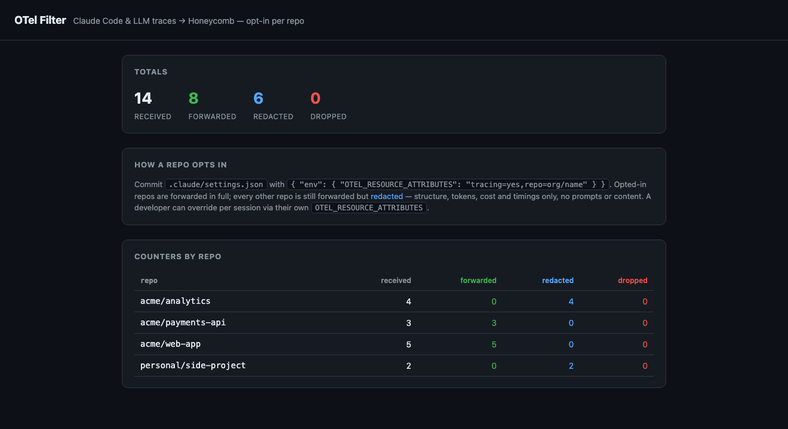

# filtering-llm-otel-proxy

A tiny, dependency-free **OpenTelemetry (OTLP) filtering proxy** you run as an
AWS Lambda. It sits between your LLM tooling — [Claude
Code](https://docs.anthropic.com/en/docs/claude-code), the OpenTelemetry
OpenAI/Anthropic instrumentations, anything that speaks OTLP — and your
observability backend (this repo targets **Honeycomb**, but any OTLP sink
works).

Its one job: **only forward telemetry from repositories you've explicitly
allowlisted, and drop the rest** — then show you a live count of what got
forwarded vs dropped, per repo.

> Why? When you turn on Claude Code telemetry across an org, every laptop starts
> shipping metrics and events. This proxy makes sure only *sanctioned org
> repositories* reach your paid backend — no rogue side-projects, no personal
> repos, no surprise ingest bill — with a simple allowlist you manage from a
> web dashboard.

```
  claude / other LLM tools ──OTLP/HTTP──▶  API Gateway ──▶  Lambda
                                                              │  match resource.attributes.repo
                                                              │  against the allowlist
                                                              ▼
                                                  ┌─ allowed ─▶  Honeycomb (OTLP)
                                                  └─ everything else ─▶  dropped
                                           counters + allowlist persisted (DynamoDB)
```



<p align="center"><em>The admin dashboard: edit the repo allowlist, watch received / forwarded / dropped counters per repo.</em></p>

## How filtering works

LLM tools stamp a repo identifier onto the OTLP **resource**. With Claude Code
you set it via `OTEL_RESOURCE_ATTRIBUTES=repo=acme/web-app` when you enable
telemetry (see [Claude Code environment variables](#claude-code-environment-variables)
for the full set).

The proxy reads `resource.attributes.repo` from every `resourceSpans` /
`resourceMetrics` / `resourceLogs` entry and keeps only entries whose repo is
allowlisted. Entries are matched **exactly** (`acme/web-app`) or by
**prefix** (`acme/*`). Anything not matched — including telemetry with no
repo attribute — is dropped and counted. Change the attribute name with
`REPO_ATTR`.

The proxy handles all three OTLP signals — `/v1/traces`, `/v1/metrics`,
`/v1/logs` — and passes each whitelisted resource through untouched (it drops
whole non-allowlisted repos, never individual fields).

## Claude Code environment variables

These are set **on the machine running `claude`**, not on the proxy. They control
what Claude Code exports and where.

**Required — metrics + events:**

```bash
export CLAUDE_CODE_ENABLE_TELEMETRY=1
export OTEL_METRICS_EXPORTER=otlp
export OTEL_LOGS_EXPORTER=otlp
export OTEL_EXPORTER_OTLP_PROTOCOL=http/json          # or http/protobuf, grpc
export OTEL_EXPORTER_OTLP_ENDPOINT=https://<your-endpoint>
export OTEL_RESOURCE_ATTRIBUTES=repo=acme/web-app     # ← the allowlist key (required)
```

This exports metrics (`claude_code.token.usage`, `.cost.usage`, `.session.count`)
and log events (`user_prompt`, `api_request`, `assistant_response`,
`mcp_server_connection`, …).

**Full distributed traces** (the nice Honeycomb waterfalls — root
`claude_code.interaction` → `claude_code.llm_request` / `claude_code.tool` spans
with `gen_ai.*` semantic conventions) — add:

```bash
export CLAUDE_CODE_ENHANCED_TELEMETRY_BETA=1          # beta flag; enables span tracing
export OTEL_TRACES_EXPORTER=otlp
```

Tracing is **not plan-gated** — it works on any plan, gated only by this beta
opt-in. (Claude Cowork / office-agents telemetry is a separate, Team/Enterprise,
admin-portal-configured surface.)

**Prompt / response / tool content** — redacted by default; opt in per signal:

| Variable | Default | Adds |
|----------|---------|------|
| `OTEL_LOG_USER_PROMPTS` | off | user prompt text (`user_prompt` attr on the interaction span) |
| `OTEL_LOG_ASSISTANT_RESPONSES` | off | model response text (`assistant_response` log record) |
| `OTEL_LOG_TOOL_DETAILS` | off | tool names, arguments, commands (`full_command` attr) |
| `OTEL_LOG_TOOL_CONTENT` | off | tool input/output (`tool.output` span event; needs tracing on) |
| `OTEL_LOG_RAW_API_BODIES` | off | full Messages API request/response JSON (`api_request_body` / `api_response_body` log records) |

Gotchas learned the hard way:

- **The content flags do not cascade.** `OTEL_LOG_RAW_API_BODIES=1` alone still
  leaves `user_prompt` and `assistant_response` `<REDACTED>` — set
  `OTEL_LOG_USER_PROMPTS=1` and `OTEL_LOG_ASSISTANT_RESPONSES=1` explicitly for
  the readable text.
- **Content leaves your machine only to your OTLP endpoint — never to Anthropic.**
  It can contain source, secrets, and PII; enable deliberately, and use the repo
  allowlist to scope which repos are allowed to send it.
- **Bodies can truncate** (`body_truncated=true`) for large contexts.

The response text and raw bodies arrive on the **logs** signal but carry the same
`trace_id`/`span_id` as their `llm_request` span, so Honeycomb ties them to the
trace — use the trace's **View events** to read them inline.

## Quick start (local, zero dependencies)

```bash
npm test                         # unit + e2e tests against captured Claude Code payloads
WHITELIST='acme/*' npm start # serves OTLP + the admin dashboard on :4318
open http://localhost:4318/admin
```

`npm start` uses the in-memory store — no AWS, no database. Point any OTLP
exporter at `http://localhost:4318` and watch the counters move.

## Deploy to AWS

Two paths — both create the same thing (Lambda + DynamoDB + a **public API
Gateway** OTLP endpoint).

**AWS SAM:**
```bash
sam deploy --guided --template infra/template.yaml \
  --parameter-overrides HoneycombApiKey=$HONEYCOMB_API_KEY AdminToken=$(openssl rand -hex 16)
```

**Plain AWS CLI** (no SAM required — this is the script this repo was tested
with):
```bash
HONEYCOMB_API_KEY=... bash infra/deploy-cli.sh
```

### A note on the public endpoint

The simplest front door is a **Lambda Function URL**, but many enterprise AWS
orgs block public Function URLs with an SCP on `lambda:FunctionUrlAuthType`. So
this repo fronts the Lambda with an **API Gateway HTTP API** instead — public,
unauthenticated, and not caught by that guardrail. The OTLP ingest paths are
open (exporters can't send credentials); the `/admin` dashboard and API are
gated by a bearer token (`ADMIN_TOKEN`).

## Configuration

| Env | Purpose | Default |
|-----|---------|---------|
| `STORE` | `dynamo` for production, else in-memory | in-memory |
| `TABLE_NAME` | DynamoDB table (when `STORE=dynamo`) | — |
| `WHITELIST` | comma-separated seed allowlist (in-memory store only) | empty |
| `REPO_ATTR` | resource attribute holding the repo id | `repo` |
| `HONEYCOMB_API_KEY` | ingest key; **absent = dry-run** (filter & count, don't send) | — |
| `HONEYCOMB_DATASET` | dataset for metrics/logs | `claude-code` |
| `HONEYCOMB_ENDPOINT` | OTLP sink base URL (use `api.eu1.honeycomb.io` for EU) | `https://api.honeycomb.io` |
| `ADMIN_TOKEN` | bearer token gating `/admin*` (blank = open) | open |

Forwarding to any other OTLP backend is a one-file change in
[`src/forward.js`](src/forward.js).

## Persistence options

The store is a small interface (`getWhitelist / addRepo / removeRepo /
recordTally / getStats`) under [`src/store/`](src/store/). Two are implemented;
the rest are drop-in replacements.

| Option | Whitelist | Counters | VPC? | Notes |
|--------|-----------|----------|------|-------|
| **DynamoDB** ✅ *(default, implemented)* | item w/ String Set | atomic `ADD` increments, no races | No | Best fit for Lambda: serverless, pay-per-request, SDK already in the runtime. |
| **In-memory** ✅ *(implemented)* | Set | object | No | Dev/tests only — resets on cold start. |
| **SSM Parameter Store / env** | one param | ✗ | No | Great for a rarely-changing allowlist as config; pair with EMF for counts. |
| **S3** | JSON blob | ✗ (last-writer-wins) | No | Cheap for the allowlist; unsafe for counters under concurrency. |
| **Upstash Redis / Momento** | SET | `INCR` atomic | No | HTTP/serverless Redis: atomic counters + fast allowlist, no VPC. |
| **CloudWatch EMF** | ✗ | ✅ (as metrics) | No | Emit dropped/forwarded as metrics for alarms; complements any store. |
| **RDS / Aurora Serverless v2** | table | `UPDATE … +1` | Yes | Only if you already run Postgres/MySQL; adds VPC + cold-start cost. |

**Recommendation:** DynamoDB. If you'd rather keep the allowlist in Git/config
and only need aggregate drop counts, use **SSM Parameter Store + CloudWatch EMF**
and skip a database entirely.

## Project layout

```
src/
  otlp.js        OTLP/JSON attribute + signal helpers
  filter.js      pure repo-allowlist filter (unit-tested)
  forward.js     POST filtered payload to the OTLP sink (Honeycomb)
  app.js         framework-agnostic router (ingest + admin)
  dashboard.js   inline admin HTML (no build step)
  server.js      local http adapter
  lambda.js      API Gateway / Function URL adapter
  store/         memory (default) · dynamo · factory
test/            node --test, runs against real captured Claude Code payloads
infra/           SAM template + plain-CLI deploy script
```

## License

MIT.

---

**For AI engineering and operations support, contact [Freshwater
Futures](https://freshwaterfutures.com).**
